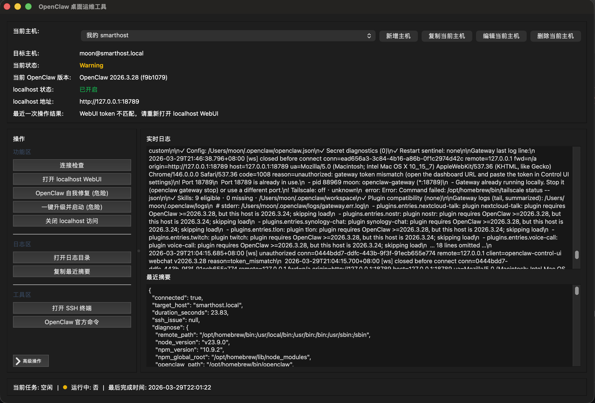

# OpenClawOps

一个基于 Python `PyQt6` 的桌面运维工具，用来通过本机 `ssh` 连接远程主机，集中处理 OpenClaw 的连接检查、WebUI 访问、自我修复、升级启动和常见故障排查。



## 项目背景

这个工具的目标不是替代 OpenClaw 官方 CLI，而是把远程运维里最常见、最容易出错的几个动作收敛成桌面入口。

典型场景是：

- OpenClaw 运行在另一台 Mac、Linux 主机或家庭服务器上
- 当前管理端无法直接访问远端的 WebUI，只能先通过 `ssh` 登录
- 需要在图形界面里快速完成连接检查、localhost 转发、升级、自我修复和日志查看
- 希望降低手动输入命令、复制 token、处理 SSH 参数和定位历史故障的成本

因此，OpenClawOps 更像是一个“面向远程 OpenClaw 节点的桌面运维控制台”，而不是通用 SSH 客户端。

## 适用场景

- 使用一台本地 MacBook 远程管理另一台运行 OpenClaw 的主机
- 家庭服务器、开发机、测试机上的 OpenClaw 日常维护
- WebUI 无法直连时，通过 SSH 隧道临时转发到本机 `127.0.0.1`
- OpenClaw 升级后需要快速验证版本、健康状态和网关访问
- 遇到历史兼容问题时，需要快速执行自我修复或源码构建兜底

## License

MIT. See [LICENSE](/Users/moon/openclawops/LICENSE).

## 当前能力

- 多主机配置：支持在界面中新增、复制、编辑、删除主机配置
- 连接测试：主机编辑弹窗里可直接测试 SSH 连通性
- 主流程按钮：
  - `连接检查`
  - `打开 localhost WebUI`
  - `OpenClaw 自我修复`
  - `一键升级并启动`
  - `关闭 localhost 访问`
- 高级操作：
  - `环境诊断`
  - `验证 OpenClaw`
  - `源码构建兜底`
- 工具区：
  - `打开 SSH 终端`
  - `OpenClaw 官方命令`
- 状态指示：
  - 绿灯：成功
  - 黄灯：告警
  - 红灯：失败
  - 蓝灯：运行中
  - 灰灯：空闲
- localhost 访问：
  - 顶部显示 `localhost 状态` 与当前访问地址
  - 打开 WebUI 时会自动确认并按需建立本地转发
  - 会自动获取或生成 gateway token，并用本机地址打开

## 本地运行

```bash
python3 -m venv .venv
source .venv/bin/activate
pip install -r requirements.txt
cp .env.example .env
python app.py
```

## 安装与分发

源码运行：

```bash
python3 app.py
```

macOS 打包产物：

- `dist/OpenClawOps.app`

Windows 打包产物：

- `dist\OpenClawOps\`，需在 Windows 上执行打包

## 配置方式

第一次使用时，可以直接复制 [`.env.example`](/Users/moon/openclawops/.env.example)。程序内置的是通用示例主机，推荐后续直接在界面顶部通过 `新增主机` / `编辑当前主机` 来维护连接信息，而不是手改配置文件。

`.env` 中的核心字段包括：

- `DISPLAY_NAME`
- `REMOTE_HOST`
- `REMOTE_USER`
- `SSH_IDENTITIES_ONLY`
- `SSH_IDENTITY_FILE`
- `SSH_CONFIG_PATH`
- `COMMAND_TIMEOUT_SECONDS`
- `GATEWAY_PROBE_TIMEOUT_SECONDS`
- `GATEWAY_WEB_PORT`
- `LOCAL_FORWARD_PORT`

额外主机会以 profile 形式写入 `.env`，例如：

```env
PROFILE_NAMES=staging
ACTIVE_PROFILE=default
PROFILE_STAGING_DISPLAY_NAME=预发布环境
PROFILE_STAGING_REMOTE_HOST=ops@staging.example.com
PROFILE_STAGING_REMOTE_USER=ops
```

## SSH 前置条件

- 本机可以直接执行 `ssh <user>@<host>`
- 远程主机已安装 `node`、`npm`、`openclaw`
- 如果要使用源码构建兜底，远程主机还需要 `git` 和 `pnpm`

工具默认会附带 `-o IdentitiesOnly=yes`，降低 SSH agent 中多把私钥导致 `Too many authentication failures` 的概率。

## 日志与配置落盘位置

源码运行时：

- 配置文件默认使用项目根目录下的 `.env`
- 日志默认写到项目根目录下的 `logs/`

打包运行时：

- macOS：`~/Library/Application Support/OpenClawOps/`
- Windows：`%APPDATA%\OpenClawOps\`

这可以避免打包后的应用向只读安装目录写日志或配置。

## 测试

```bash
pytest
```

## 图标与打包

统一图标资源生成：

```bash
python tools/generate_icon_assets.py
```

会生成：

- `assets/openclaw.png`
- `assets/openclaw.ico`
- `assets/openclaw.icns`

macOS 打包：

```bash
./build_macos.sh
```

Windows 打包：

```bat
build_windows.bat
```

注意：`PyInstaller` 不能在 macOS 上直接产出 Windows `.exe`，Windows 版本需要在 Windows 机器上执行打包脚本。

## 发布资料

- 发布清单：[docs/RELEASE_CHECKLIST.md](/Users/moon/openclawops/docs/RELEASE_CHECKLIST.md)
- Release 文案模板：[docs/RELEASE_NOTES_TEMPLATE.md](/Users/moon/openclawops/docs/RELEASE_NOTES_TEMPLATE.md)
